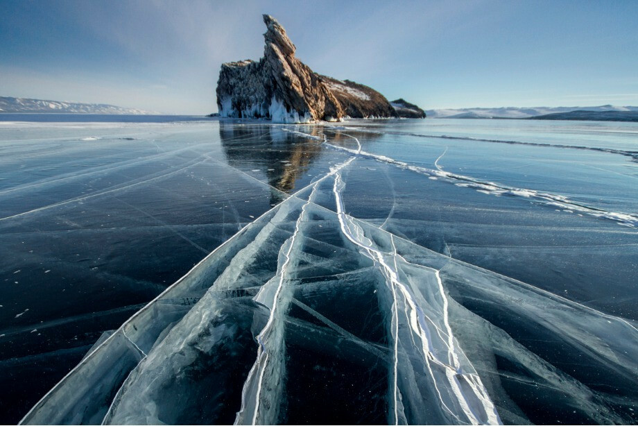

# Байкал

Байкал — не просто озеро, а живой музей природы, богатый биологическим разнообразием и культурным наследием. Почувствуйте энергию древней земли и насладитесь уникальными красотами.

## Особенности

* Более 2600 видов живых организмов, из которых около 80% эндемичны

- Незабываемая прозрачность воды и особая атмосфера местных поселений
- Идеальное место для прогулок, рыбалки и изучения природы

