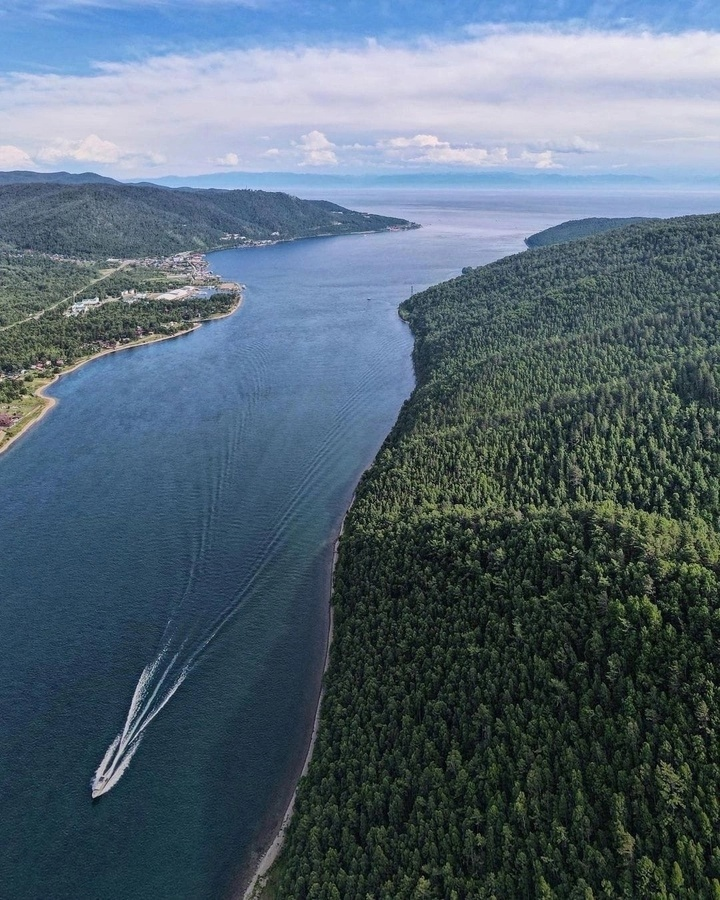

# Ангара

Ангара — истинная душа Сибири, текущая от Байкала к Енисею. Потрясающая энергия и скорость течения делают её символом силы и жизнеспособности.

## Особенности

* Зимняя рыбалка и занятия активными видами спорта

* Высокие пороговые участки и впечатляющие пейзажи

* Символ мудрости и жизненной энергии народов Сибири

  