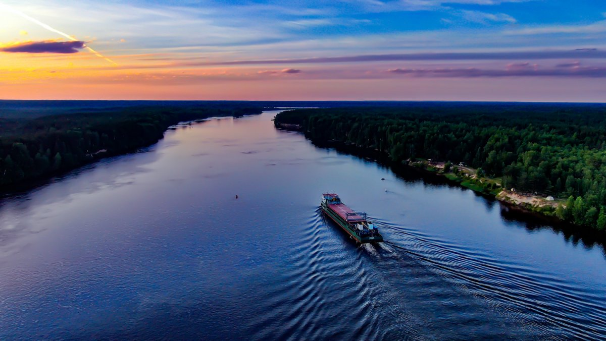

# Свирь

Свирь — важный водный путь, соединяющий Ладожское и Онежское озера. Её берега украшены великолепными пейзажами и исторической архитектурой.

## Особенности

* Туризм и круизы по живописным местам

* Рыбная ловля и активные приключения

* Интересные деревни и исторические поселения вдоль берегов

  